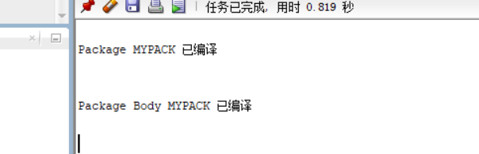
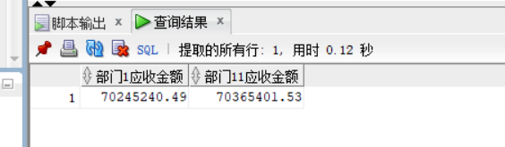

# 实验5：PL/SQL编程
## 1.创建MyPack包，以及Get_SaleAmount与Get_Employees函数
```
create or replace PACKAGE MyPack IS
  FUNCTION Get_SaleAmount(V_DEPARTMENT_ID NUMBER) RETURN NUMBER;
  PROCEDURE Get_Employees(V_EMPLOYEE_ID NUMBER);
END MyPack;
/
create or replace PACKAGE BODY MyPack IS
  FUNCTION Get_SaleAmount(V_DEPARTMENT_ID NUMBER) RETURN NUMBER
  AS
    N NUMBER(20,2); --注意，订单ORDERS.TRADE_RECEIVABLE的类型是NUMBER(8,2),汇总之后，数据要大得多。
    BEGIN
      SELECT SUM(O.TRADE_RECEIVABLE) into N  FROM ORDERS O,EMPLOYEES E
      WHERE O.EMPLOYEE_ID=E.EMPLOYEE_ID AND E.DEPARTMENT_ID =V_DEPARTMENT_ID;
      RETURN N;
    END;

  PROCEDURE GET_EMPLOYEES(V_EMPLOYEE_ID NUMBER)
  AS
    LEFTSPACE VARCHAR(2000);
    begin
      --通过LEVEL判断递归的级别
      LEFTSPACE:=' ';
      --使用游标
      for v in
      (SELECT LEVEL,EMPLOYEE_ID,NAME,MANAGER_ID FROM employees
      START WITH EMPLOYEE_ID = V_EMPLOYEE_ID
      CONNECT BY PRIOR EMPLOYEE_ID = MANAGER_ID)
      LOOP
        DBMS_OUTPUT.PUT_LINE(LPAD(LEFTSPACE,(V.LEVEL-1)*4,' ')||
                             V.EMPLOYEE_ID||' '||v.NAME);
      END LOOP;
    END;
END MyPack;
```


## 2.测试Get_SaleAmount函数
```
select MyPack.Get_SaleAmount(1) AS 部门1应收金额,MyPack.Get_SaleAmount(11) AS 部门11应收金额 from dual;
```


## 3.测试Get_Employees函数
```
set serveroutput on
DECLARE
  V_EMPLOYEE_ID NUMBER;    
BEGIN
  V_EMPLOYEE_ID := 1;
  MYPACK.Get_Employees (  V_EMPLOYEE_ID => V_EMPLOYEE_ID) ;  
  V_EMPLOYEE_ID := 11;
  MYPACK.Get_Employees (  V_EMPLOYEE_ID => V_EMPLOYEE_ID) ;    
END;
```

